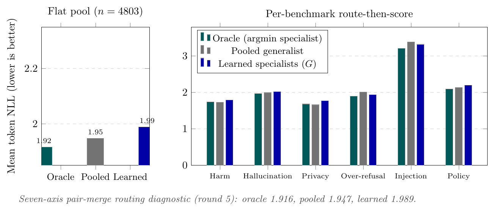
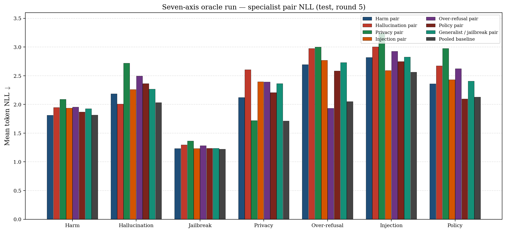
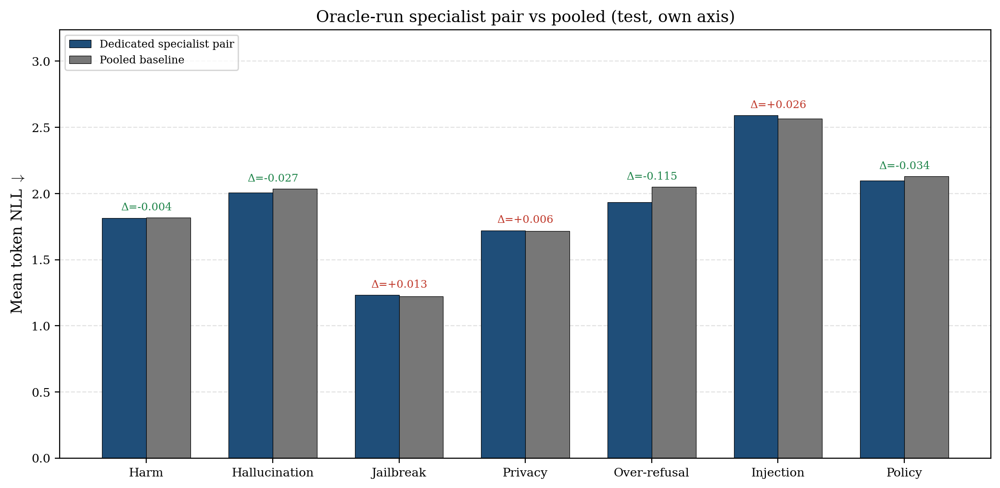
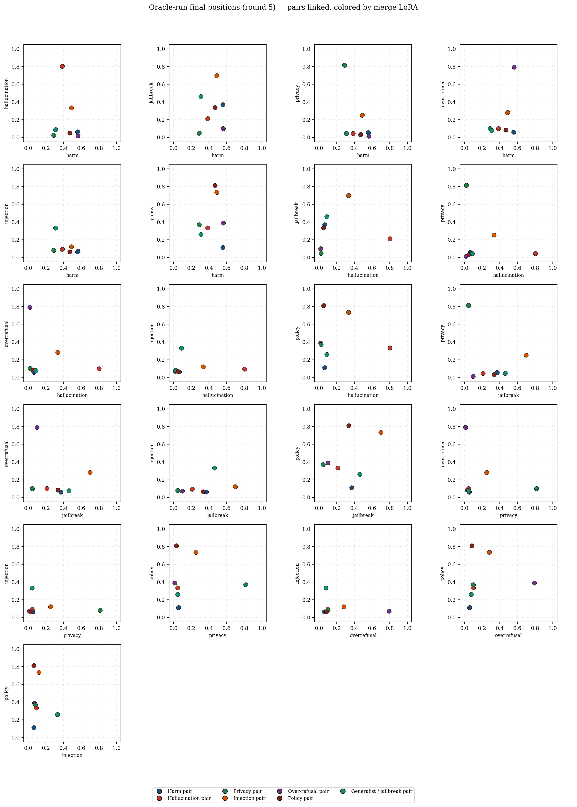
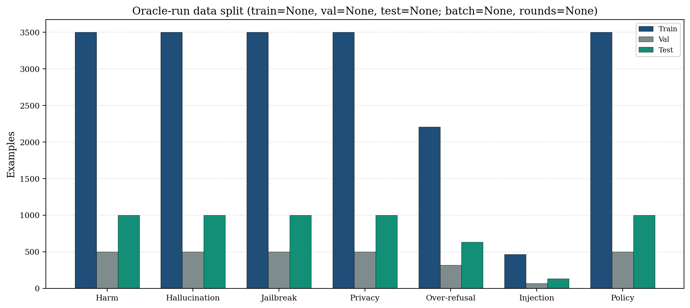
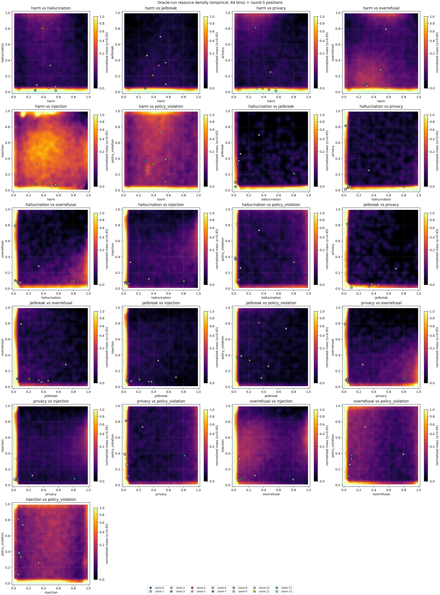
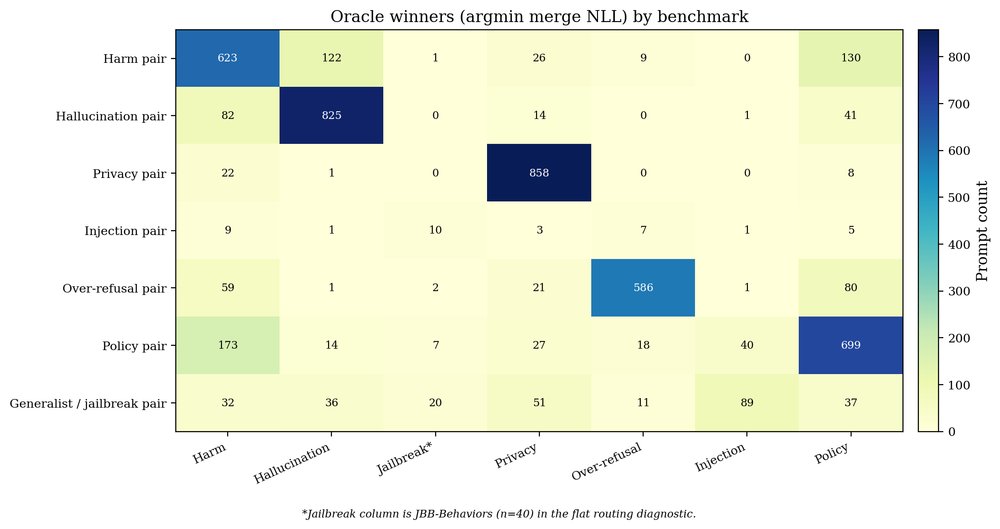
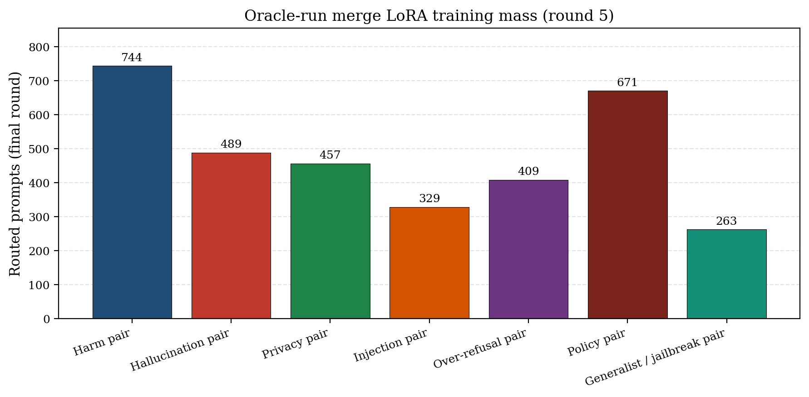

# Oracle-run figure gallery

All plots for the seven-axis pair-merge **oracle run**
(`results/seven_axis_pair_merge_split/seed0`).

**Routing headline (flat pool):** oracle **1.916** · pooled **1.947** · learned **1.989**

Regenerate NLL / position suite:

```bash
python scripts/plot_oracle_run_figures.py
```

Regenerate detailed resource density (on doob):

```bash
bash scripts/rebuild_oracle_resource_density.sh
```

---

## Comparison (oracle vs pooled vs learned)

| | |
|---|---|
| Flat pool + per-benchmark routing | [oracle_vs_generalist_vs_specialists.png](../oracle_vs_generalist_vs_specialists.png) · [pdf](../oracle_vs_generalist_vs_specialists.pdf) · [tex](../oracle_vs_generalist_vs_specialists.tex) |



---

## Specialist-pair NLL

| | |
|---|---|
| All merges × all benchmarks (test) | [specialist_pair_nll.png](specialist_pair_nll.png) · [pdf](specialist_pair_nll.pdf) · [tex](specialist_pair_nll.tex) |
| Dedicated specialist vs pooled (own axis) | [specialist_vs_pooled.png](specialist_vs_pooled.png) · [pdf](specialist_vs_pooled.pdf) |





---

## Positions

| | |
|---|---|
| Final positions (round 5), pairs linked | [final_positions.png](final_positions.png) · [pdf](final_positions.pdf) |
| Merge-pair radar profiles | [merge_pair_profiles.png](merge_pair_profiles.png) · [pdf](merge_pair_profiles.pdf) |
| Theory init on resource (fixed positions) | [theory_positions_on_resource.png](theory_positions_on_resource.png) · [pdf](theory_positions_on_resource.pdf) |



---

## Data & resource density

| | |
|---|---|
| Train / val / test split | [data_split.png](data_split.png) · [pdf](data_split.pdf) |
| Resource density (coarse `n_grid=3` KDE — **superseded**) | [resource_density_coarse.png](resource_density_coarse.png) |
| Resource density **detailed** (empirical 64-bin + round-5 positions) | [resource_density.png](resource_density.png) · [pdf](resource_density.pdf) · [detailed](resource_density_detailed.png) |





---

## Routing diagnostics

| | |
|---|---|
| Oracle winner counts (merge × benchmark) | [oracle_support.png](oracle_support.png) · [pdf](oracle_support.pdf) |
| Final-round merge training mass | [merge_prompt_counts.png](merge_prompt_counts.png) · [pdf](merge_prompt_counts.pdf) |





---

## Merge groups (from config)

| Merge LoRA | Clones |
|---|---|
| `merge-harm` | clone-3, clone-6 |
| `merge-hallucination` | clone-5, clone-11 |
| `merge-privacy` | clone-7, clone-12 |
| `merge-injection` | clone-4, clone-10 |
| `merge-overrefusal` | clone-0, clone-13 |
| `merge-policy` | clone-2, clone-8 |
| `merge-generalist` (jailbreak pair) | clone-1, clone-9 |
